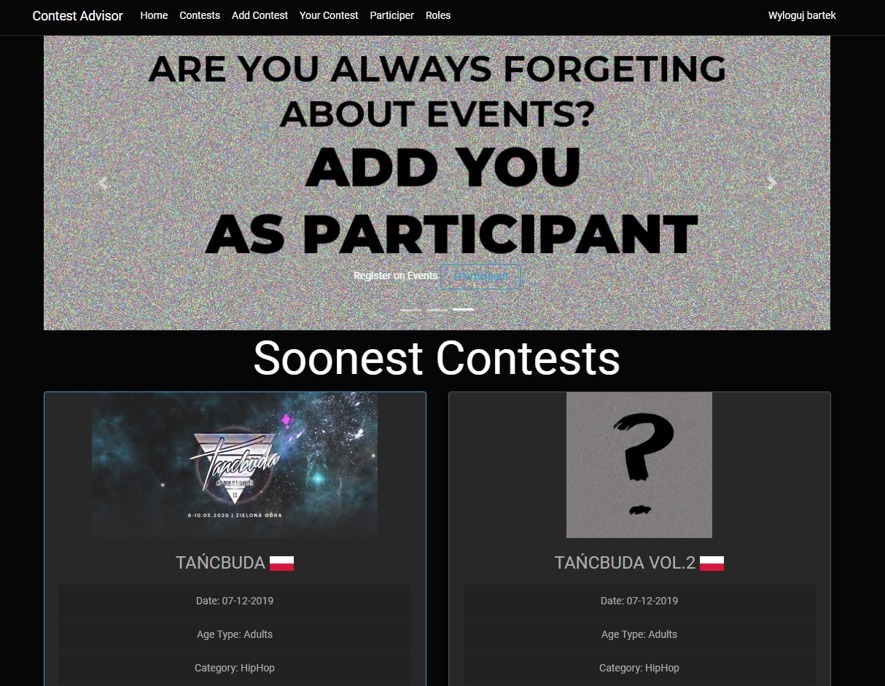

# ContestAdvisor
Project of Dance Contest Platform. That was my final project of CodersLab Course of .NET Developer. This site is specialy made for
dancers that want to update their events or want to be up to date with another contests. 

## Table of contents
* [General info](#general-info)
* [Technologies](#technologies)
* [Page](#page)

## General info
Platform uses .NET CORE.MVC and MSSQL databases. User after registration is able to add contest and be admin of this contest so can edit,
delete and give extra information, but also control list of participants. User are able to search for events and sort it by category, country 
and date, and then register as participant to event that want to. On main page there is 4 soonest events that user will be participant of. 
As admin of this platform you are able to control every event, every participant list and users. 
	
## Technologies
Project is created with:

* Entity Framework Core 2
* ASP NET CORE.MVC 5
* MSSQL
* BOOTSTRAP 4
* JQUERY

##Page
